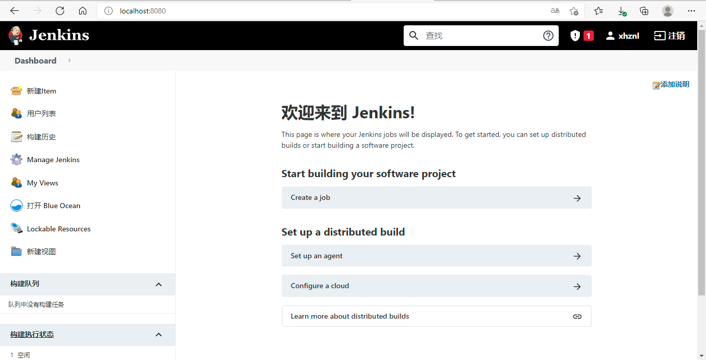

## devops入门

环境：

- Windows 10
- Docker Desktop
- Jenkins
- Github
- .NET5


### 安装Jenkins

```bash
# 拉取Jenkins镜像
docker pull jenkinsci/blueocean

# 运行容器
docker run ^
  -u root ^
  -d ^
  -p 8080:8080 ^
  -p 50000:50000 ^
  -v jenkins-data:/var/jenkins_home ^
  -v /var/run/docker.sock:/var/run/docker.sock ^
  --name jenkinsci-blueocean ^
  jenkinsci/blueocean
```

访问Jenkins:


解锁Jenkins:


```bash
# 访问容器
docker exec -it jenkinscl-blueocean bash

# 查看密钥
cat /var/jenkins_home/secrets/initialAdminPassword

# 将得到的密钥填入 d0f9fb1c5d3f47369d93d27ad4cd1ea8

# 退出bash
exit
```

填入密钥后 继续...

选择默认推荐插件...

创建管理员用户...

实例配置...

Jenkins已就绪...




### 准备项目


Dockerfile:

```dockerfile
FROM mcr.microsoft.com/dotnet/aspnet:5.0-buster-slim AS base
WORKDIR /app
EXPOSE 80

FROM mcr.microsoft.com/dotnet/sdk:5.0-buster-slim AS build
RUN curl -sL https://deb.nodesource.com/setup_14.x | bash -
RUN apt-get install -y nodejs
RUN npm config set registry https://registry.npm.taobao.org
WORKDIR /src
COPY ["src/Summer.Web/Summer.Web.csproj", "src/Summer.Web/"]
COPY ["src/Summer.App/Summer.App.csproj", "src/Summer.App/"]
COPY ["src/Summer.App.Contracts/Summer.App.Contracts.csproj", "src/Summer.App.Contracts/"]
RUN dotnet restore "src/Summer.Web/Summer.Web.csproj"
COPY . .
WORKDIR "/src/src/Summer.Web"
RUN dotnet build "Summer.Web.csproj" -c Release -o /app/build

FROM build AS publish
RUN dotnet publish "Summer.Web.csproj" -c Release -o /app/publish

FROM base AS final
WORKDIR /app
COPY --from=publish /app/publish .
ENTRYPOINT ["dotnet", "Summer.Web.dll"]
```

```bash
# cd到项目根目录

# 构建镜像
docker build -t summerweb -f ./src/Summer.Web/Dockerfile .

# 运行容器
docker run -d -p 5000:80 --name summerweb summerweb
```


### 构建自由风格项目


