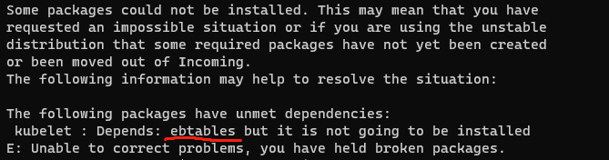
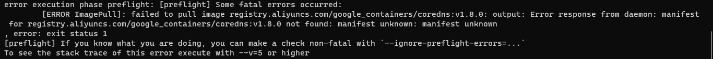
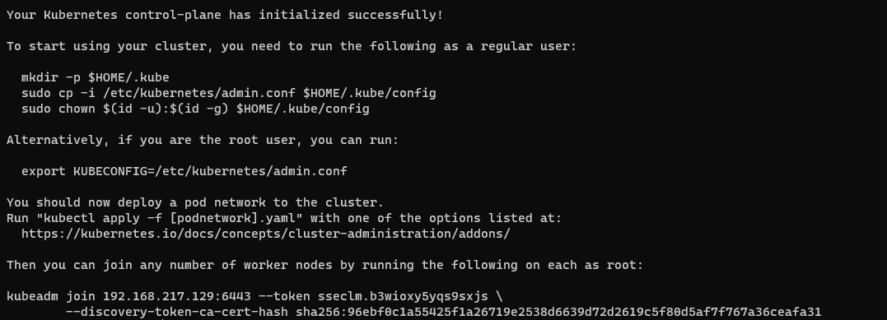
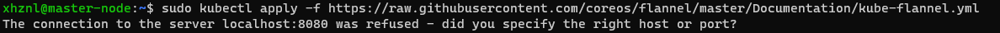

# :star:kubernetes

## 集群搭建

### 环境准备

3台 **Ubuntu 18.04** vm，1个master node ，2个worker node

#### 配置ubuntu国内源

```bash
# 1.备份源
sudo cp /etc/apt/sources.list /etc/apt/sources.list.bak

# 2.编辑源
sudo vim /etc/apt/sources.list

# 3.修改为以下内容
deb http://mirrors.aliyun.com/ubuntu/ focal main restricted universe multiverse
deb-src http://mirrors.aliyun.com/ubuntu/ focal main restricted universe multiverse

deb http://mirrors.aliyun.com/ubuntu/ focal-security main restricted universe multiverse
deb-src http://mirrors.aliyun.com/ubuntu/ focal-security main restricted universe multiverse

deb http://mirrors.aliyun.com/ubuntu/ focal-updates main restricted universe multiverse
deb-src http://mirrors.aliyun.com/ubuntu/ focal-updates main restricted universe multiverse

deb http://mirrors.aliyun.com/ubuntu/ focal-proposed main restricted universe multiverse
deb-src http://mirrors.aliyun.com/ubuntu/ focal-proposed main restricted universe multiverse

deb http://mirrors.aliyun.com/ubuntu/ focal-backports main restricted universe multiverse
deb-src http://mirrors.aliyun.com/ubuntu/ focal-backports main restricted universe multiverse
#

# 4.更新软件列表
sudo apt-get update

# 5.更新软件包
sudo apt-get upgrade
```

#### 安装docker

```bash
# 1.新建 install_docker.sh 文件，输入以下内容
sudo apt-get update
sudo apt-get install -y apt-transport-https ca-certificates 
curl gnupg-agent software-properties-common
curl -fsSL https://download.docker.com/linux/ubuntu/gpg | sudo apt-key add -
sudo apt-key fingerprint 0EBFCD88
sudo add-apt-repository "deb [arch=amd64] https://download.docker.com/linux/ubuntu $(lsb_release -cs) stable"
sudo apt-get update
sudo apt-get -y install docker-ce docker-ce-cli containerd.io

sudo mkdir -p /etc/docker
sudo tee /etc/docker/daemon.json  <<-EOF
{
  "registry-mirrors": [
    "https://8nzxa9he.mirror.aliyuncs.com"
  ]
}
EOF
sudo systemctl daemon-reload
sudo systemctl restart docker

sudo systemctl enable docker
#

# 2.执行
sh install_docker.sh

# 3.验证docker是否安装成功
docker
```

#### 安装kubernetes

```bash
# 1.新建 install_k8s.sh 文件，输入以下内容
sudo curl -s https://mirrors.aliyun.com/kubernetes/apt/doc/apt-key.gpg | sudo apt-key add -
sudo cat <<EOF >/etc/apt/sources.list.d/kubernetes.list
deb https://mirrors.aliyun.com/kubernetes/apt/ kubernetes-xenial main
EOF
sudo apt-get update
sudo apt-get install -y kubelet kubeadm kubectl --allow-unauthenticated
#

# 2.执行
sudo sh install_k8s.sh

# 3.验证kubernetes是否安装成功
kubectl
```

缺少依赖报错：



安装 ebtables 即可： `sudo apt-get install ebtables`

看报错提示，缺哪个 install 哪个

#### 关闭swap

它是系统的交换分区，你可以理解为**虚拟内存**。当系统内存不足的时候，会将一部分硬盘空间虚拟成内存使用

性能考虑，避免开启swap交换，K8S希望所有的服务都不应该超过集群或节点CPU和内存的限制

`sudo swapoff -a`

`sudo vim /etc/fstab`

注释掉 swap.img 行

#### 修改主机名

便于记忆

```bash
# 主节点
sudo hostnamectl set-hostname master-node

# 工作节点1
sudo hostnamectl set-hostname worker-node1

# 工作节点2
sudo hostnamectl set-hostname worker-node2
```

#### 初始化集群

再主节点执行：

```bash
sudo kubeadm init --image-repository registry.aliyuncs.com/google_containers --kubernetes-version v1.21.3 --pod-network-cidr=10.244.0.0/16
```

报错：



坑：coredns:1.8.0 改为 coredns:v1.8.0 少了个"v"

```bash
# 去阿里云拉取coredns:1.8.0镜像
sudo docker pull registry.aliyuncs.com/google_containers/coredns:1.8.0

# 重新打标签 1.8.0 改为 v1.8.0
sudo docker tag registry.aliyuncs.com/google_containers/coredns:1.8.0 registry.aliyuncs.com/google_containers/coredns:v1.8.0

# 删除掉原有镜像
sudo docker rmi registry.aliyuncs.com/google_containers/coredns:1.8.0

# 再次执行init
sudo kubeadm init --image-repository registry.aliyuncs.com/google_containers --kubernetes-version v1.21.3 --pod-network-cidr=10.244.0.0/16
```

初始化成功：



这个信息要记录下来，用于工作节点加入集群

```bash
kubeadm join 192.168.217.129:6443 --token sseclm.b3wioxy5yqs9sxjs \
        --discovery-token-ca-cert-hash sha256:96ebf0c1a55425f1a26719e2538d6639d72d2619c5f80d5af7f767a36ceafa31
```

执行以下命令 主要为了执行 kubectl 这类命令时，不用每次 sudo

```bash
mkdir -p $HOME/.kube
sudo cp -i /etc/kubernetes/admin.conf $HOME/.kube/config
sudo chown $(id -u):$(id -g) $HOME/.kube/config
```

#### 安装网络通信插件

```bash
# 安装Flannel
sudo kubectl apply -f https://raw.githubusercontent.com/coreos/flannel/master/Documentation/kube-flannel.yml
```

报错：



原因：kubernetes master没有与本机绑定，集群初始化的时候没有绑定，此时设置在本机的环境变量即可解决问题

```bash
# 编辑环境变量
sudo vim /etc/profile
# 追加以下内容 保存
export KUBECONFIG=/etc/kubernetes/admin.conf
#

# 使生效
source /etc/profile
```

