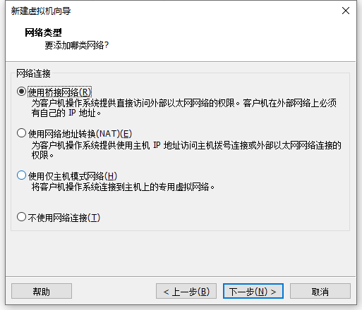

# linux

## vm 安装centos 7

准备centos 7 iso 镜像文件，vm 新建虚拟机




右键虚拟机设置


开启虚拟机，进入安装


**配置网络：**

修改 /etc/sysconfig/network-scripts/ifcfg-ens33

```bash
cd /etc/sysconfig/network-scripts/

ls

vim ifcfg-ens33

#
TYPE=Ethernet
BOOTPROTO=static
DEVICE=ens33
ONBOOT=yes
IPADDR=172.18.3.60
NETMASK=255.255.254.0
GATEWAY=172.18.2.1
DNS1=8.8.8.8
#

# 重启网络服务
service network restart
```


## 常用命令

### 文件权限


r = 4 (2^2)

w = 2(2^1)

x 1 1(2^0)

修改文件权限 `chmod 764 1.txt`（等价于`chmod u=rwx,g=rw,o=r 1.txt`）

tips: 7=4+2+1(rwx)  6=4+2(rw) 4=4(r)


