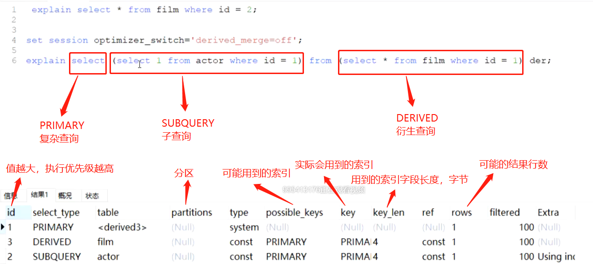

# :star:mysql

mysql学习笔记。。。:book::book::book:

## 索引基础

索引是帮助mysql高效获取数据的排好序的数据结构

### 数据结构

#### 二叉树

左边的子节点小于父节点，右边子节点大于父节点

缺点：当数据出现单边增长时，会退化成链表结构，达不到优化效果

#### 红黑树

平衡二叉树，会随着数据的插入自动做平衡处理，平衡树的左右高度

缺点：数据量大时，树的高度依然不可控

#### Hash（索引方法）

- 对索引的key进行一次hash计算就可以定位出数据存储的位置
- 很多时候Hash索引要比B+Tree索引更高效
- 缺点：仅能满足“=”，“IN”，不支持范围查询；hash冲突问题

#### B-Tree

- 叶子节点具有相同的深度，叶子节点的指针为空
- 所有索引元素不重复
- 节点中的数据索引从左到右递增排列

#### B+Tree（索引方法）

B-Tree变种

- 非叶子节点不存储data，只存储索引（冗余），可以放更多的索引
- 叶子节点包含所有的索引字段
- 叶子节点用指针连接，提高区间访问的性能

tips:

​	mysql默认页大小16kb，假如索引字段使用bigint类型(8byte)，下一个子节点的地址(6byte)，一个非叶子节点约可以存储1170个索引*16384/(8+6)=1170*

可以修改默认页大小，但是不建议。

### 存储引擎

#### MyISAM

- 非聚集索引-叶子节点存放索引和完整数据行的磁盘地址

- MyISAM索引文件和数据文件是分离的

#### InnoDB

- 聚集索引-叶子节点包含了完整的数据行记录
  - 聚集索引的查询速度略优于非聚集索引
- 表数据文件本身就是按照B+Tree组织的一个索引结构文件
- 建议InnoDB表必须建立主键，并且推荐使用整形的自增主键
  - 主键唯一，为了组织主键索引B+Tree，必须要有数据唯一列。如果没有主键列，mysql会从表中找一个数据唯一列来组织B+Tree，如果没找到，mysql会建立一个隐藏的数据唯一列（rowid）
  - 整形占用空间小，且利于比较大小
  - B+Tree元素本身是从左到右顺序排列，自增主键可以避免B+Tree重新排列，分裂
- 非主键索引（二级索引，非聚集索引）结构的叶子节点存储的是主键值
  - 节约空间，数据一致性
  - 查询时先定位到主键，再通过主键索引去拿到整行数据（回表）

tips:一张表只有一个聚集索引，就是用来组织这棵B+树的索引，通常就是主键

### 联合索引

#### 索引最左前缀原则

查询条件必须符合索引字段从左到右的顺序，不能跳过前面的字段

tips:mysql查询器会优化sql语句的查询字段顺序，即使字段顺序不对也会走索引，前提是不能跳过

为什么？

跳过前面字段的话，无法确定元素是顺序排列的，违背了索引基本要求

### Explain

#### Explain中的列

- id

  - id列的编号是select的序列号，有几个select就有几个id，并且id的顺序是按照select出现的顺序增长的

  - id列越大执行优先级越高

- select_type

  - simple:简单查询。不包含子查询和union
  - primary:复杂查询中最外层的select
  - subquery:包含在select中的子查询（不在from子句中）
  - derived:包含在from子句中的子查询。mysql会将结果存放在一个临时表中，也成为衍生表（派生 derived）
  - union:在union中的第二个和随后的select

- table

  表示explain的一行正在访问的表

  - 当from子句有子查询时，table列是`<derivedN>`格式，表示当前查询依赖id=N的查询，于是先执行id=N的查询
  - 当有union时，UNION RESULT的table列的值为`<union1,2>`，1和2表示参与union的select行id

- type

  表示关联类型或访问类型，即mysql决定如何查找表中的行，查找数据行记录的大概范围。

  依次从最优到最差分别为：**system>const>eq_ref>ref>range>index>ALL**

  一般来说，得保证查询达到range级别，最好达到ref

  - NULL

    mysql能够在优化阶段分解查询语句，在执行阶段用不着再访问表或索引。例如：在索引列中选取最小值，可以单独查找索引来完成，不需要在执行时访问表

    

  - const,system

    mysql能对查询的某部分进行优化并将其转化成一个常量（可以看show warnings）。用于primary key或unique key的所有列与常数比较时，所以表最多有一个匹配行，读取1次，速度比较快。**system是const的特例**，表里只有1条元素匹配时为system

    

    tips:

    ​	dual:mysql中的空表

  - eq_ref

    primary key或unique key索引的所有部分被连接使用，最多只会返回一条符合条件的记录。这可能是在const之外最好的连接类型，简单的select查询不会出现这种type

    

  - ref

    相比eq_ref，不使用唯一索引，而是使用普通索引或者唯一索引的部分前缀，索引要和某个值相比较，可能会找到多个符合条件的行

    

  - range

    范围扫描通常出现在in(),between,>,<,>=,<=等操作中，使用一个索引来检索给定范围的行

    

  - index

    全索引扫描，一般是扫描某个二级索引，这种扫描不会从索引树根节点开始快速查找，而是直接对二级索引的叶子节点遍历和扫描，速度还是比较慢的，这种查询一般为使用**覆盖索引**，二级索引一般比较小，所以通常比ALL快一些

    

  - ALL

    即全表扫描，扫描聚簇索引的所有叶子节点。通常情况下这需要增加索引来进行优化

    

- possible_keys

  显示查询可能使用哪些索引来查找

  explain时可能出现 possible_keys有值，而key显示NULL的情况，这种情况是因为表中数据不多，mysq认为索引对此查询帮助不大，选择了全表查询
  如果该列是NULL，则没有相关的索引。在这种情况下，可以通过检查 where子句看是否可以创造一个适当的索引来提高查询性能，然后用explain查看效果

- key

  显示mysq实际采用哪个索引来优化对该表的访问

  如果没有使用索引，则该列是NULL。如果想强制 mysql使用或忽视possible_keys列中的索引，在查询中使用 force index、 ignore index

- key_len

  这一列显示了mysq在索引里使用的字节数，通过这个值可以算出具体使用了索引中的哪些列

  举例来说，film_actor的联合索引 idx_film_acto_id由film_id和 actor_id两个int列组成，并且每个int是4字节。通过结果中的 keylen=4可推断出查询使用了第一个列: film id列来执行索引查找

  

  
  
- ref

  显示了在key列记录的索引中，表查找值所用到的列或常量，常见的有: const(常量)，字段名(例:film.id)

  

- rows

  mysql估计要读取并检测的行数，注意这个不是结果集里的行数

- Extra

  额外信息列

  Using index：使用覆盖索引

  Using where：使用 where 语句来处理结果，并且查询的列未被索引覆盖

  Using index condition：查询的列不完全被索引覆盖，where条件中是一个前导列的范围

  Using temporary：mysql需要创建一张临时表来处理查询。出现这种情况一般是要进行优化的，首先是想到用索引来优化

  Using filesort：将用外部排序而不是索引排序,数据较小时从内存排序，否则需要在磁盘完成排序。这种情况下一般也是要考虑使用索引来优化的

   Select tables optimized away：使用某些聚合函数(比如max、min)来访问存在索引的某个字段时

### 覆盖索引

​		mysql explain执行计划结果里的key有使用索引，如果 select后面查询的字段都可以从这个索引的树中获取，这种情况一般可以说是用到了覆盖索引，extra里一般都有using index；覆盖索引一般针对的是辅助索引，整个查询结果只通过辅助索引就能拿到结果，不需要通过辅助索引在树找到主键，再通过主键去主键索引树里获取其它字段值

### 索引最佳实践

- 全值匹配

  针对联合索引需要遵循最左前缀原则以及中间不可断

- 不在索引列上做任何操作(计算、函数、(自动or手动)类型转换)，会导致索引失效而转向全表扫描

- 存储引擎不能使用索引中范围条件右边的列

- 尽量使用覆盖索引(只访问索引的查询(索引列包含查询列))，减少 select语句

- mysql 在使用不等于(!=或者<>)的时候无法使用索引会导致全表扫描

- is null is not null 一般情况下也无法使用索引

- like以通配符开头('$abc...') mysql索引失效会变成全表扫描操作

  

- 字符串不加单引号索引失效（类型转换了）

- 少用or或in，用它查询时，mysql不一定使用索引，mysql内部优化器会根据检索比例、表大小等多个因素整体评估是否使用索引

- 范围查询优化

  将大的范围拆分成多个小范围，可能会走索引

  

  

**注意**：

​		mysql是否使用索引查询是不确定的，哪怕同一条sql在不同场景下是否走索引也是不一样的，对于主键索引使用主键查询，大部分都会走索引查询。对于二级索引，如果果集比结较小，那么mysql可能会选择走索引，如果结果集很大，那么mysql可能选择全表扫描。所以针对sql优化，是需要结合业务场景优化的，抛开业务场景优化sql并不一定能提高效率。

**索引使用总结**

tips:上图7和10，实际上用到了索引下推

## mysql底层执行原理

## 索引优化

### 索引下推

mysql5.6引入索引下推优化

对于联合索引，可以在索引遍历过程中，对索引中包含的所有字段先做判断，过滤掉不符合条件的记录之后再回表，可以有效的减少回表次数

范围查询 >，< 通常不走索引下推，like 'xxx%' 通常会走索引下推，通常 >，< 会比 like 'xxx%' 结果集要大，这时索引下推可能不如直接回表效率高

### trace分析工具

### Order by / Group by

Tips:

​		group by 与 order by 类似，实质是**先排序后分组**，对于 group by 如果确定不需要排序，可以加上 **order by null** 禁止排序

​		grouy by 能用 where 限定的条件就不要用 having ，having 主要是弥补了WHERE关键字不能与聚合函数联合使用的不足

### filesort

- 单路排序

  一次性取出所有 select 字段，在 sort buffer 中进行排序

- 双路排序（回表模式排序）

  只取出**排序字段**和可以定位行数据的行**ID**，在 sort buffer 中进行排序，再根据 ID 回表获取其他 select 字段

mysql 内部会根据查询字段大小， max_length_for_sort_data 判断使用哪种排序方式

### 索引设计原则

- 先完成主体业务代码，再根据sql语句建立索引

- 联合索引尽量覆盖条件 where,order by,group by

- 不要在基数小（重复数据过多）的字段上建立索引

- 长字符串可以采用前缀索引 KEY index(name(20),age,position) 

- where 与 order by 设计冲突时优先保证 where

- 慢查询

  MySQL的慢查询，全名是**慢查询日志**，是MySQL提供的一种日志记录，用来记录在MySQL中**响应时间超过阀值**的语句。

  具体环境中，运行时间超过`long_query_time`值的SQL语句，则会被记录到慢查询日志中。

  long_query_time的默认值为10，意思是记录运行10秒以上的语句。

  默认情况下，MySQL数据库并不启动慢查询日志，需要手动来设置这个参数。

  当然，如果不是调优需要的话，一般不建议启动该参数，因为开启慢查询日志会或多或少带来一定的性能影响。

  慢查询日志支持将日志记录写入文件和数据库表。

### limit

### Join

假设：t1 100行，t2 10000行

- 嵌套循环连接 Nested-Loop Join (NLJ) 算法

  一次一行循环从第一张表（驱动表）中读取行，在这行数据中取到关联字段，根据关联字段在另一张表（被驱动表）里取出满足条件的行，然后取出2张表的结果合集

  - left join 左表是驱动表，右表是被驱动表
  - right join 右表是驱动表，左表是被驱动表
  - inner join mysql优化器会选择小表做驱动表，大表做被驱动表
    - 小表，大表：**是看参与关联的行大小（包含where条件），并不是表的总大小**

  **通常走索引时会采用这个算法**

  t1 磁盘扫描 100 次，t2 磁盘扫描 100 次（走索引） =  200 次磁盘扫描

- 基于块的嵌套循环连接 Block Nested-Loop Join (BNL) 算法

  把驱动表的数据读到 join_buffer 中，然后扫描被驱动表，把被驱动表每一行取出来跟 join_buffer 中的数据对比

  **没走索引时会采用这个算法**

  t1 磁盘扫描 100 次，t2 磁盘扫描 10000 次（不走索引） =  10100 次磁盘扫描

  100 * 10000 = 1000000 次 join_buffer 内存比对

  join_buffer 大小不够时，会分片处理

**总结：**

​	关联字段建立索引，被驱动表一定要走索引

​	让小表作为驱动表，大表作为被驱动表，必要时可以用sql强制指定驱动表（inner join）

​    join 不要超过 3 张表

### in / exists

in 后面的先执行

exists 前面的先执行

exists 可以用 join 替代

### count

字段有索引：

- count(*) ≈ count(1) > count(字段) > count(主键id)

字段没有索引：

- count(*) ≈ count(1) > count(主键id) > count(字段)

其实效率都差不多，直接用count(*)就行

count(*) 不会取全部字段值，只是按行累加，效率很高

count(1) 也不会取字段值，只是用常量1统计

count(id) 如果有二级索引的话，也会优先走二级索引

count(字段) 不会统计 null 值

